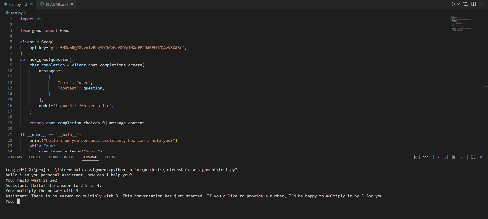
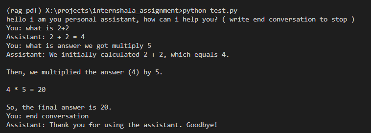

# AI_assignment_kk
This will be a repo to record every step i take to complete the assignment.

Phase 1: Decide what task to do
1. I have decided to go with a simple chatbot as i can make it a summarizer too if i want.
2. researched free api keys and decided to use "Groq api" as i was familier with it.
3. start a basic project.

Phase 2: Building
1. copied a simple skeletal code from Groq'sdevloper page to see if the api key is working or not
2. after confirming that api works i converted that skeletal code to a function that inputed a text(question) and gave out an answer
3. 

I noticed a few problems:
    1. Inifnite loop no termination clause to stop that chat.
    2. No context retention so every message is treated as new.

The first problem can be solved by a conditional statement
for the second problem i asked chat gpt: "how do you remember context" and it answered
something like i pass the question get an answer then combine them to form a context and then add it to new question and pass
it to the llm to get a new answer, so i tried implementing it.

this is the result: , better than before but it still had some problems like if chat got too big it was giving wrong answers.
This was happening due to input being longer than input size of the model hence the input was being truncated resulting in improper answers.

To tackle this i can either use Langchain which was inbulilt context manager or i can build one myself using rag.
i chose rag method as i was more interested in it than just using pre-build modules, if this didn't work i would fall back to langchain.

The rough idea is to use vector embeddings to store chats and combine them with recent k chats to create my own custom context manager.
so the flow will be:
1. user inputs a question. the question is then searched us in the vector database, for this i will be using faiss wrapper by langchain.
2. we fetch top n results and combine then with last k messages so we get a combination of recent context and past context with relevance,
this helps keeping the context managebale and somewhat useful.
3. then we combine all of these with the input question and feed it to llm to get a response.
4. present the answer to the user and store the last question and answer of it to the queue of recent chats and vector storage.

!Potential challenges might be duplicate context selection but we can check for duplicated but it takes extra time.

Commited and pushed progress till now.
Got a security error as i was trying to push my api key so i created a .env file to store my api key and used dotenv module to load it, used gpt to figure this.

Phase 3: Implement custome context.
1. looked up langchain faiss docs to setup basic implementation of vector storage
2. used AllMinillm instead of openAi embeddings used in faiss example as they are smaller and does not require any api key to use.
3. tested the embedding model and it works.

Consulted GPT over the memory parameter in vectore store variable and it turn out this vectore store is stored in ram if not asked to store on dist hence my previous argument to use a hybrid approach over inbuilt context manager was void so i consulted gpt again to ask if there are any benefits to my approach and yes there is, even though they both are stored on memory the inbult manager acts like my previous implementation of feeding the model everthing asked previously so it is not scalable hence my approach was somewhat better if implemented properly.

Did some more research on the model i was using i.e "llama-3.3-70b-versatile" and found it has a context window of 131,072 tokens which is rought equal to 500k characters if each token is 4 charaters long which is equal to 100k words which i think is pretty big context window and i won't be needing this hybrid approach so i will stick with normal "pass it all" approach for now, but if i were to add rag capablities then i will consider hybrid approach to get context from the pdf or other data sources.

looked up langchain docs and gpt to see how to use their inbuild context manager.
The skeletal structure is now complete it takes input and gives output while still maintaing the context, but chatting in terminal feels wierd and not user friendly so i'll try to make a ui or front end and use fast api for api devlopment.

Phase 4: api devlopment using fastAPI
Due to approaching deadline i asked claude to do the rest of the work i.e write a faiss app and create simple frontend
prompt i used :"write a fast api app for this, make it async so that model and frontend loads separately, also write a simple frontend using html css and js for this, if necessary make changes in main.py too, provide a file structure too and explain what and why did you do them."

Here are the things groq did
1. made the app async so frontend and model loads seperatly
2. added a session manager and clear chat option to clear that session good for long or multiple conversation as it prevents holding of information of precious chats and ever chat starts a new saving space
3. make a simple but functional ui, it shows loading or dots animation while loading.

commited
